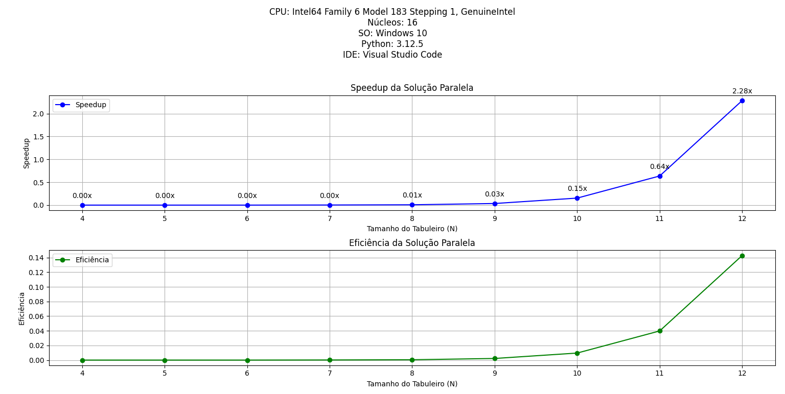
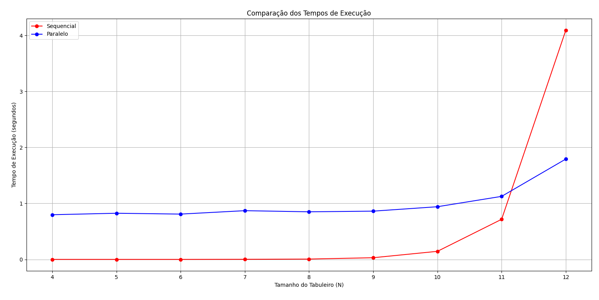

# Projeto: Resolução do Problema das N-Rainhas

Este projeto implementa duas abordagens para resolver o clássico problema das N-Rainhas: uma solução sequencial e uma solução paralela. O objetivo é comparar o desempenho entre as duas abordagens e analisar o ganho de eficiência ao utilizar processamento paralelo.


## Introdução

O problema das N-Rainhas é um problema clássico de colocação, onde o objetivo é posicionar N rainhas em um tabuleiro NxN de forma que nenhuma rainha possa atacar outra. O problema possui uma complexidade combinatória, o que torna interessante a exploração de diferentes abordagens para resolvê-lo.

Este projeto implementa:
- **Uma solução sequencial:** que resolve o problema de forma tradicional, verificando todas as possibilidades.
- **Uma solução paralela:** que distribui o problema em várias partes, resolvendo-as simultaneamente em múltiplos núcleos da CPU.

## Estrutura do Projeto

```
nqueens/
│
├── solver.py                 # Implementação base do solucionador das N-Rainhas
├── sequential.py             # Implementação sequencial
├── parallel.py               # Implementação paralela
├── main.py                   # Script principal que executa os testes e gera os gráficos
└── README.md                 # Este arquivo
```

## Instalação

Clone este repositório e instale as dependências necessárias utilizando `pip`.

## Execução

Para executar o projeto e visualizar os resultados dos testes:

```bash
python main.py
```

Isso executará tanto a solução sequencial quanto a paralela para diferentes tamanhos de tabuleiro (N), exibindo gráficos de comparação de tempo, speedup e eficiência.

## Funcionalidades

### Classes Principais

1. **`NQueensSolver`**
   - Classe base que implementa a lógica central do problema das N-Rainhas.
   - Método `solve_util`: Método recursivo que utiliza backtracking para resolver o problema.
   - Método `is_safe`: Verifica se é seguro colocar uma rainha em uma posição específica.

2. **`SequentialNQueensSolver`**
   - Implementa a solução sequencial, herdando de `NQueensSolver`.
   - Método `solve`: Resolve o problema de forma sequencial e mede o tempo de execução.

3. **`ParallelNQueensSolver`**
   - Implementa a solução paralela, também herdando de `NQueensSolver`.
   - Método `solve`: Resolve o problema utilizando múltiplos processos, dividindo o problema entre os núcleos da CPU.
   - Método `solve_partial`: Resolve o problema parcialmente, começando a partir de uma linha específica do tabuleiro.

### Funções Auxiliares

- **`measure_time(func)`**: Um decorator utilizado para medir o tempo de execução das funções `solve` nas classes `SequentialNQueensSolver` e `ParallelNQueensSolver`.

## Gráficos e Análise de Desempenho

Ao final da execução do script, uma série de gráficos será gerada para analisar o desempenho das soluções sequencial e paralela. Esses gráficos são essenciais para entender a eficiência do processamento paralelo em comparação ao sequencial. 

### Gráficos Gerados

1. **Speedup da Solução Paralela**
   - **Descrição**: Este gráfico mostra o speedup obtido pela solução paralela em relação à solução sequencial. O speedup é definido como a razão entre o tempo de execução da solução sequencial e o tempo de execução da solução paralela.
   - **Interpretação**: Um speedup maior que 1 indica que a solução paralela foi mais rápida que a sequencial. O ideal é que o speedup aumente conforme o tamanho do problema (N) cresce.

2. **Eficiência da Solução Paralela**
   - **Descrição**: Este gráfico exibe a eficiência da solução paralela, que é calculada como o speedup dividido pelo número de processos utilizados. A eficiência ideal é 1, o que indicaria uso perfeito dos recursos paralelos.
   - **Interpretação**: Uma eficiência próxima de 1 indica que os recursos paralelos estão sendo bem utilizados. A eficiência tende a diminuir à medida que o número de processos aumenta ou o tamanho do problema não justifica o paralelismo.

3. **Comparação dos Tempos de Execução**
   - **Descrição**: Este gráfico compara os tempos de execução das soluções sequencial e paralela para diferentes tamanhos de tabuleiro (N).
   - **Interpretação**: Espera-se que a solução paralela tenha um tempo de execução menor que a sequencial, principalmente para valores maiores de N, onde o problema se torna mais complexo.

Os gráficos fornecem uma visão clara dos benefícios e limitações do uso de paralelismo para resolver o problema das N-Rainhas, permitindo uma análise aprofundada de desempenho.

## Informações do Sistema

O script principal (`main.py`) exibe as informações do sistema em que os testes foram executados, incluindo:

- Modelo da CPU
- Número de núcleos
- Sistema Operacional
- Versão do Python
- IDE utilizada




