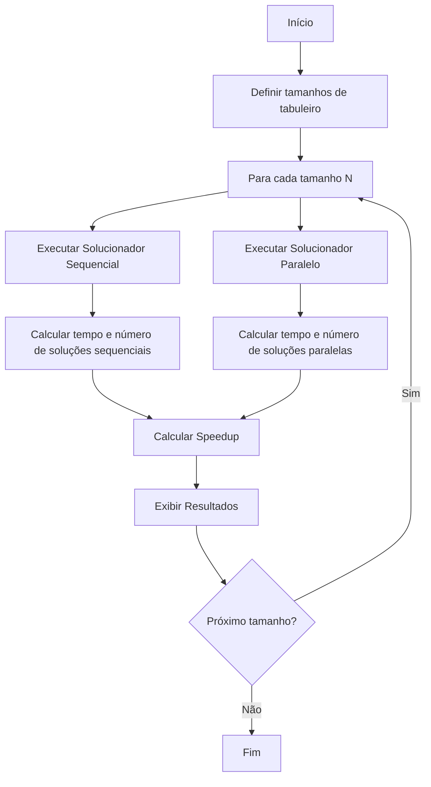

# Organização do Grupo e Atividades

Inicialmente, o grupo focou em explorar diferentes abordagens para resolver o problema das N Rainhas, buscando métodos algorítmicos que fossem populares e amplamente documentados na internet ou que o grupo conseguisse entender coletivamente. Analisamos diversos métodos, incluindo **Backtracking**, **Força Bruta**, **Algoritmos Genéticos**, **Programação Dinâmica**, **Heurísticas e Meta-heurísticas**, e **Algoritmos Gulosos (Greedy)**. Testamos várias implementações para decidir qual método seria o mais adequado, e, por fim, escolhemos o método **Backtracking**.

A matriz abaixo ilustra os critérios utilizados para avaliar cada método antes de fazermos a escolha final:

| Critério                          | Backtracking                                             | Força Bruta                                                 | Algoritmos Genéticos                                       | Programação Dinâmica                                     | Heurísticas / Meta-heurísticas                            | Algoritmo Guloso                                           |
|-----------------------------------|----------------------------------------------------------|-------------------------------------------------------------|------------------------------------------------------------|-----------------------------------------------------------|------------------------------------------------------------|------------------------------------------------------------|
| **Descrição Geral**               | Busca incremental com retrocesso                         | Testa todas as combinações possíveis                        | Evolução de soluções potenciais                            | Divide em subproblemas e armazena resultados              | Usa regras e otimizações baseadas em experiência           | Faz a escolha mais favorável no momento                    |
| **Eficiência em N-Rainhas**       | Boa para N médio, cresce exponencialmente com N           | Extremamente ineficiente para N grande                      | Moderada, encontra boas soluções, mas não a ótima          | Não aplicável para N-Rainhas devido à falta de subproblemas sobrepostos | Pode ser rápida, mas não garante solução ótima              | Não aplicável pois decisões locais não garantem solução global |
| **Facilidade de Implementação**   | Moderada                                                  | Simples                                                     | Complexa, requer ajuste de parâmetros                      | Alta complexidade, requer identificação de subproblemas   | Moderada, depende da heurística escolhida                  | Simples, mas inadequada para N-Rainhas                     |
| **Garantia de Solução**           | Garante encontrar todas as soluções                      | Garante encontrar todas as soluções                         | Não garante solução ótima, apenas boas soluções            | Garante solução ótima para problemas aplicáveis           | Não garante solução ótima, apenas aproximações             | Não garante solução correta para N-Rainhas                 |
| **Aplicabilidade para N grande**  | Ineficiente para N muito grande                           | Impraticável para N > 10 devido ao tempo exponencial        | Pode ser usado, mas requer muito processamento             | Não aplicável devido à falta de estrutura de subproblemas | Pode ser eficiente com ajustes, mas depende da heurística  | Ineficiente e não aplicável para grandes N                 |
| **Uso de Memória**                | Moderado (depende da profundidade da árvore)              | Alto (armazena todas as combinações)                        | Moderado a alto (depende do tamanho da população)          | Alto (necessário para armazenar resultados de subproblemas) | Variável (depende da implementação da heurística)          | Baixo                                                       |
| **Paralelização**                 | Dificuldade moderada de paralelização                     | Alta paralelização possível (combinando todas as possibilidades) | Boa capacidade de paralelização (operações genéticas independentes) | Difícil, devido à natureza sequencial da maioria dos problemas aplicáveis | Alta paralelização possível dependendo da heurística       | Difícil de paralelizar, pois decisões são sequenciais       |
| **Exemplos de Uso**               | N-Rainhas, Sudoku, quebra-cabeças                         | Teste de todas as combinações possíveis, ataque de força bruta | Problemas de otimização, roteamento, agendamento            | Problemas como mochila, sequência comum mais longa        | Problemas de otimização e busca com conhecimento prévio    | Problemas de troca de moedas, árvores geradoras mínimas    |


## Atividades

Todos os membros contribuíram para o código base. Foram realizadas quatro reuniões para desenvolver o código base após a decisão da escolha do método. Após essa etapa, identificamos a possibilidade de explorar ainda mais o código base, coletando métricas e exibindo-as de maneira visual. Cada membro ficou responsável por implementar uma métrica a partir do código base ou buscar conhecimentos específicos para compartilhar com o grupo e na apresentação.

### **Distribuição de Tarefas por Membro**

**Welyson**:
- Explicação sobre o Problema das N Rainhas.
- Justificativa para a escolha do método de Backtracking.
- Motivo da escolha do Python como linguagem.
- Desenvolvimento de um mapa de calor para visualização das posições das rainhas.
- Implementação e salvamento de logs de execução.

**Felipe**:
- Justificativa para o uso de multiprocessos ao invés de threads.
- Identificação de possíveis melhorias no código base.

**Cunha**:
- Explicação sobre a linha `multiprocessing.cpu_count()`.
- Detalhamento do Global Interpreter Lock (GIL) do Python.
- Criação de gráficos de contenção de locks.
- Desenvolvimento de dashboards interativos utilizando Plotly e Bokeh.
- Análise das diferentes configurações de multiprocessamento (ProcessPoolExecutor vs. ThreadPoolExecutor).

**Zuin**:
- Gráficos de overhead de comunicação e uso de CPU.
- Desenvolvimento de gráfico de uso de memória (opcional).
- Fluxograma da execução do código base (referenciando a ferramenta VSCode).

**Gabriel**:
- Gráficos de Speedup com referência comparativa entre execuções paralelas e sequenciais.
- Análise e plotagem da eficiência em porcentagem.
- Desenvolvimento de gráficos de escalabilidade (tentativa ou eliminação se necessário).
- Descrição do ambiente de execução do script: especificações da CPU, sistema operacional, versão do Python, IDE utilizada (falta especificar a IDE).

Oobservação: Nem todas as tarefas foram implementadas 😥

## Organização das Pastas

```
SistemasDistribuidosNrainhas/
│
├── Base/ 
│
├── Welyson/ 
│   └── README.md # Explicações sobre o problema das N Rainhas, escolha do método de Backtracking, escolha do Python, mapa de calor das posições das rainhas e logs
│
├── Felipe/ 
│   └── README.md # Explicações sobre o uso de multiprocessos ao invés de threads e sugestões de melhorias
│
├── Cunha/ 
│   └── README.md # Explicações sobre `multiprocessing.cpu_count()`, o GIL, gráficos de contenção de locks, e diferentes configurações de multiprocessamento
│
├── Zuin/ 
│   └── README.md # Descrição dos gráficos de overhead de comunicação, uso de CPU, e fluxograma da execução do código base
│
└── Gabriel/ 
    └── README.md # Explicações sobre os gráficos de Speedup e Eficiência, análise de escalabilidade, e detalhes do ambiente de execução do script
│
├── README.md # Documentação geral sobre a organização do grupo, atividades, base do código e as soluções sequencial e paralela, como usar.
```

Esta estrutura organizada permite que cada membro do grupo trabalhe de forma independente, enquanto contribui para o objetivo comum do projeto. A documentação detalhada e os gráficos produzidos facilitam a compreensão dos resultados e a comunicação das descobertas na apresentação final.

# Documentação do Solucionador N-Rainhas

## Sumário
1. [Introdução](#introdução)
2. [Método Utilizado](#método-utilizado)
3. [Funções Principais](#funções-principais)
4. [Pontos-Chave do Código](#pontos-chave-do-código)
5. [Como Usar](#como-usar)
6. [Possíveis Alterações](#possíveis-alterações)
7. [Requisitos](#requisitos)
8. [Fluxograma de Sequência](#fluxograma-de-sequência)

## Introdução

Este projeto implementa solucionadores para o problema das N-Rainhas, tanto de forma sequencial quanto paralela. O problema das N-Rainhas consiste em posicionar N rainhas em um tabuleiro de xadrez NxN de modo que nenhuma rainha possa atacar outra.

## Método Utilizado

O algoritmo utilizado para resolver o problema das N-Rainhas é baseado na técnica de **backtracking**. Aqui está uma descrição do método:

1. **Backtracking**: 
- **Definição**: Técnica de busca sistemática utilizada para resolver problemas de decisão, onde soluções são construídas incrementalmente. Se uma solução parcial não pode ser estendida para uma solução completa, o algoritmo retrocede ("backtracks") para a última decisão tomada e tenta outra alternativa.

- **Aplicabilidade**: Ideal para problemas onde soluções podem ser visualizadas como um espaço de árvore de decisões, como o problema das N Rainhas, Sudoku, problemas de caminhos em grafos, etc.

2. **Aplicação ao problema das N-Rainhas**:
   - O algoritmo começa colocando uma rainha na primeira coluna.
   - Para cada coluna subsequente, tenta colocar uma rainha em cada linha.
   - Após colocar uma rainha, verifica se a posição é segura (não conflita com outras rainhas).
   - Se a posição for segura, move para a próxima coluna.
   - Se não for segura ou se todas as posições na coluna forem tentadas sem sucesso, faz "backtrack" para a coluna anterior e tenta a próxima posição.
   - O processo continua até que todas as rainhas sejam colocadas com sucesso ou todas as possibilidades sejam esgotadas.

3. **Paralelização**:
   - A versão paralela divide o problema em subproblemas independentes.
   - Cada subproblema começa com a primeira rainha em uma linha diferente da primeira coluna.
   - Isso permite que múltiplos processos trabalhem simultaneamente em diferentes partes do espaço de solução.

4. **Eficiência**:
   - O backtracking é mais eficiente que a força bruta, pois evita explorar caminhos que já se sabe que não levarão a uma solução válida.
   - A paralelização aproveita múltiplos núcleos de processamento, reduzindo significativamente o tempo total de execução para tabuleiros grandes.

Este método permite encontrar todas as soluções possíveis para o problema das N-Rainhas de maneira sistemática e eficiente.

## Funções Principais

### Classe NQueensSolver (solver.py)

1. `__init__(self, n: int)`: 
   - Inicializa o solucionador com o tamanho do tabuleiro.

2. `is_safe(self, board: List[List[int]], row: int, col: int) -> bool`:
   - Verifica se é seguro colocar uma rainha em uma posição específica.

3. `solve_util(self, board: List[List[int]], col: int) -> bool`:
   - Método recursivo auxiliar para resolver o problema usando backtracking.

4. `solve(self) -> List[List[List[int]]]`:
   - Resolve o problema das N-Rainhas e retorna todas as soluções.

5. `measure_time(func)`:
   - Decorador para medir o tempo de execução de uma função.

### Classe SequentialNQueensSolver (sequential.py)

1. `solve(self) -> Tuple[List[List[List[int]]], float]`:
   - Implementa a solução sequencial do problema.

### Classe ParallelNQueensSolver (parallel.py)

1. `__init__(self, n: int)`:
   - Inicializa o solucionador paralelo, definindo o número de processos.

2. `solve_partial(self, start_row: int) -> List[List[List[int]]]`:
   - Resolve parcialmente o problema, começando com a primeira rainha em uma linha específica.

3. `solve(self) -> Tuple[List[List[List[int]]], float]`:
   - Implementa a solução paralela do problema usando multiprocessing.

### Função main() (main.py)

- Executa os solucionadores sequencial e paralelo para diferentes tamanhos de tabuleiro.
- Calcula e exibe o speedup da versão paralela em relação à sequencial.

## Pontos-Chave do Código

1. **Backtracking**: Utilizado na implementação do algoritmo de solução.
2. **Paralelização**: Divisão do problema em subproblemas independentes para processamento paralelo.
3. **Medição de Desempenho**: Cálculo de speedup para comparar as versões sequencial e paralela.
4. **Flexibilidade**: O código permite testar diferentes tamanhos de tabuleiro facilmente.

## Como Usar

1. Execute o arquivo `main.py`:
   ```
   python main.py
   ```
2. O programa irá resolver o problema das N-Rainhas para os tamanhos de tabuleiro definidos em `n_values`.
3. Para cada tamanho, serão exibidos:
   - Número de soluções encontradas
   - Tempo de execução para as versões sequencial e paralela
   - Speedup obtido com a paralelização

## Possíveis Alterações

1. **Customização de Tamanhos**: Modifique a lista `n_values` em `main.py` para testar diferentes tamanhos de tabuleiro.
2. **Ajuste de Paralelização**: Altere `self.num_processes` em `ParallelNQueensSolver` para controlar o número de processos paralelos.
3. **Visualização de Soluções**: Adicione uma função para visualizar as soluções encontradas.
4. **Otimização de Memória**: Implemente uma versão que use geradores para economizar memória em problemas muito grandes.

## Requisitos

- Python 3.x
- Biblioteca `multiprocessing` (padrão do Python)

## Fluxograma



Este fluxograma representa a sequência de execução do programa principal (main.py), mostrando como os solucionadores sequencial e paralelo são aplicados para cada tamanho de tabuleiro, seguidos pelo cálculo e exibição dos resultados.