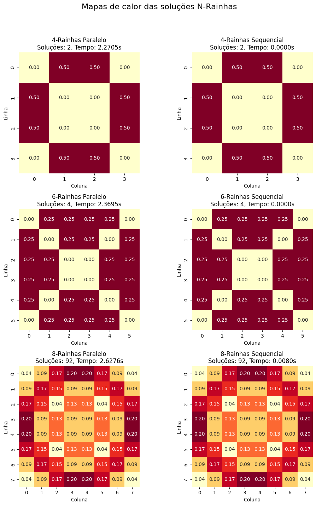

# Mapas de Calor e Logging

Este projeto implementa um solucionador para o problema das N-Rainhas usando métodos sequenciais e paralelos. Ele inclui funcionalidades para logging dos resultados e geração de mapas de calor para visualizar a distribuição das soluções.

### Logging
A classe `NQueensLogger` no arquivo `logger.py` gerencia o registro dos resultados dos solucionadores:

- Os logs são armazenados em formato JSON no diretório `./Welyson/logs`.
- Cada entrada de log contém:
  - Tamanho do tabuleiro (`n`)
  - Tipo de solucionador (Sequencial ou Paralelo)
  - Número de soluções encontradas
  - Tempo de execução
  - Todas as soluções encontradas

#### Estrutura do Log
```json
{
  "n": 8,
  "solver_type": "Sequencial",
  "num_solutions": 92,
  "time": 0.1234,
  "solutions": [[...], [...], ...]
}
```

### Geração de Heatmap
A classe `NQueensHeatmapGenerator` no arquivo `image_generator.py` cria heatmaps para visualizar os padrões das soluções:

- Heatmaps individuais para cada tamanho de tabuleiro e tipo de solucionador.
- Um heatmap combinado mostrando todas as configurações.
- Os heatmaps são salvos no diretório `./Welyson/heatmaps`.

#### Interpretando o Heatmap
- Cada célula no heatmap representa uma posição no tabuleiro de xadrez.
- A intensidade da cor indica a frequência de colocação de uma rainha naquela posição em todas as soluções.
- Cores mais escuras (vermelho) indicam colocação mais frequente, enquanto cores mais claras (amarelo) indicam colocação menos frequente.
- Os números em cada célula representam a frequência normalizada (entre 0 e 1).

## Requisitos

- Python 3.7+
- matplotlib
- seaborn
- numpy

Você pode instalar as dependências necessárias usando:

```
pip install matplotlib seaborn numpy
```

## Estrutura do Projeto

- `main.py`: Arquivo principal que executa os solucionadores e gera logs e mapas de calor.
- `logger.py`: Contém a classe `NQueensLogger` para logging dos resultados.
- `image_generator.py`: Contém a classe `NQueensHeatmapGenerator` para gerar mapas de calor.
- `nqueens/`: Diretório contendo os solucionadores sequencial e paralelo.

## Como Usar

1. Execute o script principal:
   ```
   python main.py
   ```

2. O script resolverá o problema das N-Rainhas para tabuleiros de tamanhos 4, 6 e 8, utilizando os métodos sequencial e paralelo.

3. Os resultados serão registrados e os heatmaps serão gerados automaticamente.

4. Verifique o diretório `./Welyson/logs` para obter logs detalhados em formato JSON.

5. Visualize os heatmaps gerados no diretório `./Welyson/heatmaps`.

6. Para desabilitar a geração de mapas de calor, modifique a última linha em `main.py`:

   ```python
   main(generate_heatmaps=False)
   ```

## Customização

- Para alterar os valores de N, modifique a lista `n_values` em `main.py`.
- Para ajustar os parâmetros de logging, edite a classe `NQueensLogger` em `logger.py`.
- Para modificar a aparência dos mapas de calor, edite a classe `NQueensHeatmapGenerator` em `image_generator.py`.

## Saída

Após a execução, você encontrará:

1. Arquivos de log no diretório `logs/`:
   - Formato: `nqueens_log_YYYYMMDD_HHMMSS.json`
   - Contém detalhes sobre cada execução, incluindo N, tipo de solucionador, número de soluções e tempo de execução.

2. Mapas de calor no diretório `heatmaps/`:
   - Mapas individuais: `{N}_queens/{solver_type}_heatmap.png`
   - Mapa combinado: `combined_heatmap.png`



Esta imagem mostra heatmaps para diferentes tamanhos de tabuleiro e tipos de solucionador. Analise os padrões para entender as posições comuns das rainhas e como elas mudam com o tamanho do tabuleiro ou o método de solução.
