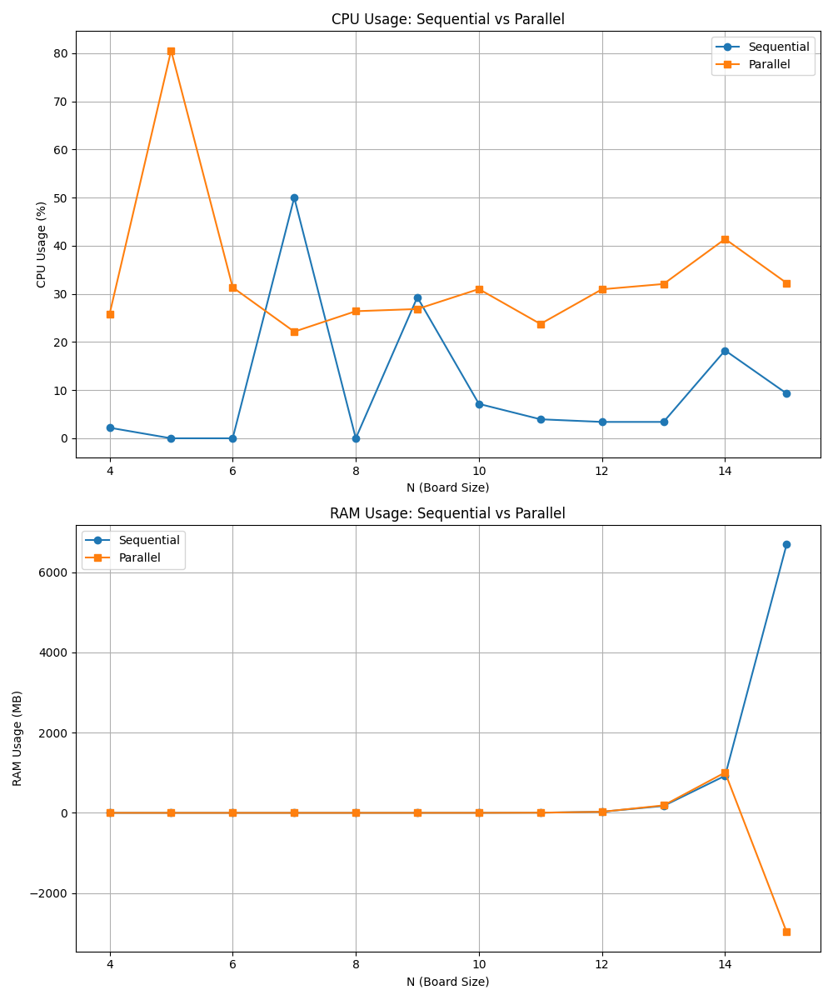

## Uso de CPU e de Memória RAM

Instale a biblioteca psutil que realiza as medições 

````
pip install psutil
````

### measure_resource_usage

Realiza a contagem de uso da CPU e da memória RAM para um dada função

### plot_resource_usage

Faz o plot dos gráficos para o Sequencial e Paralelo

### main

Reune as execuções Sequencial e Paralelo, chamando as outras duas funções

### Resultado
